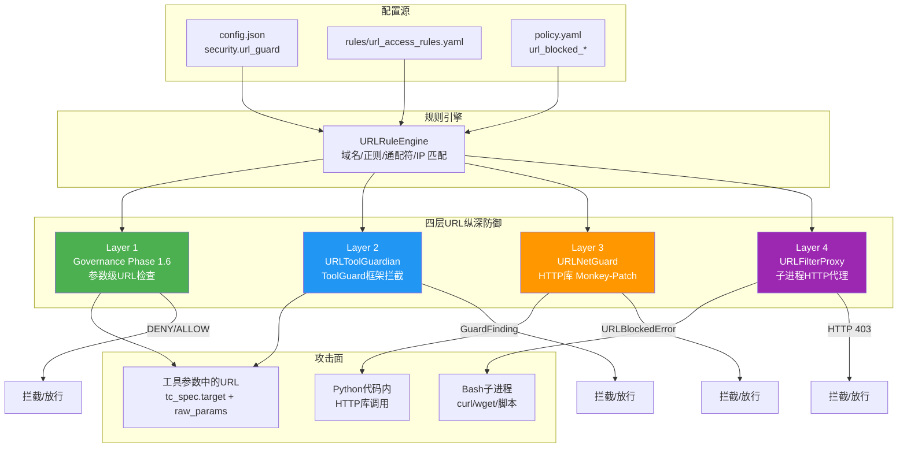
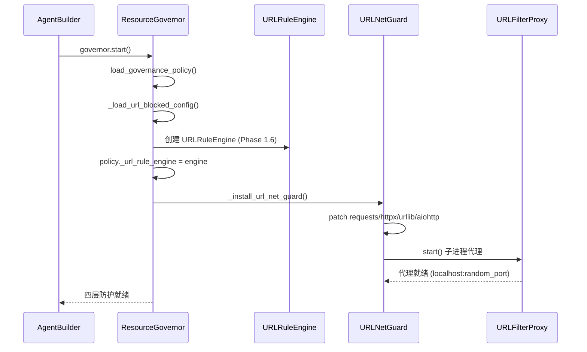
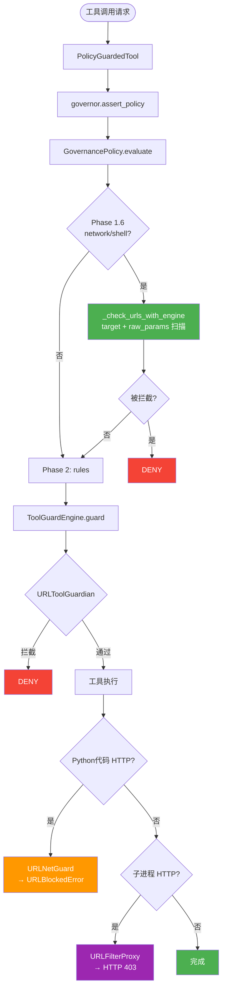
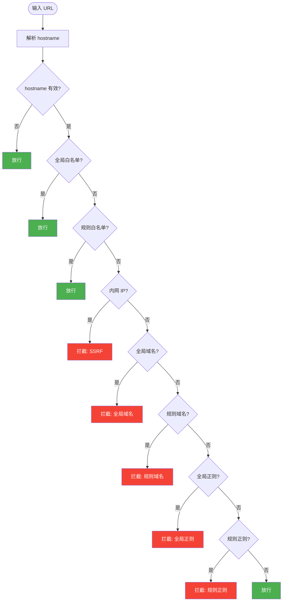
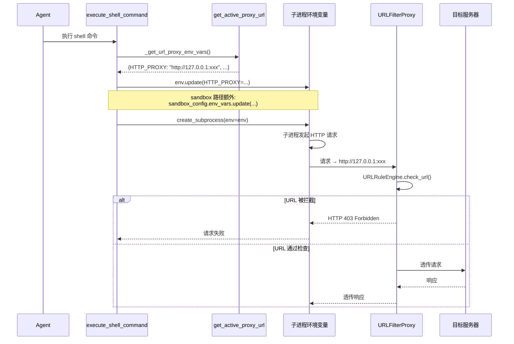

# QwenPaw URL 拦截系统技术文档

> **版本**：v5.0  
> **最后更新**：2026-07-02  
> **维护模块**：`governance/` + `security/tool_guard/`

---

## 目录

- [1. 系统概览](#1-系统概览)
- [2. 整体架构](#2-整体架构)
- [3. 四层防护详解](#3-四层防护详解)
  - [3.1 Layer 1：Governance Phase 1.6](#31-layer-1governance-phase-16)
  - [3.2 Layer 2：URLToolGuardian](#32-layer-2urltoolguardian)
  - [3.3 Layer 3：URLNetGuard（HTTP 库 Monkey-Patch）](#33-layer-3urlnetguardhttp-库-monkey-patch)
  - [3.4 Layer 4：子进程 HTTP 过滤代理](#34-layer-4子进程-http-过滤代理)
- [4. 规则引擎：URLRuleEngine](#4-规则引擎urlruleengine)
- [5. 数据流与流程图](#5-数据流与流程图)
- [6. 默认规则](#6-默认规则)
- [7. 配置体系](#7-配置体系)
- [8. 关键文件索引](#8-关键文件索引)
- [9. 设计决策与注意事项](#9-设计决策与注意事项)

---

## 1. 系统概览

QwenPaw 的 URL 拦截采用 **纵深防御** 策略，形成四层防护体系：

| 层级 | 组件 | 文件 | 拦截时机 | 覆盖范围 |
|:---:|------|------|----------|----------|
| **L1** | Governance Phase 1.6 | `governance/policy.py` | 策略评估阶段 | 工具参数中的 URL（`target` + `raw_params`） |
| **L2** | URLToolGuardian | `security/tool_guard/guardians/url_guardian.py` | Tool Guard 框架 | 工具参数中的 URL（独立检查） |
| **L3** | URLNetGuard Monkey-Patch | `security/tool_guard/url_guard/url_net_guard.py` | Python HTTP 库调用时 | `requests`/`httpx`/`urllib`/`aiohttp` 同进程请求 |
| **L4** | URLFilterProxy 子进程代理 | `security/tool_guard/url_guard/url_proxy.py` | Bash 子进程 HTTP 请求时 | `curl`/`wget`/`python script.py` 等子进程请求 |

L1-L3 共享同一个 **URLRuleEngine** 核心，L4 使用本地 HTTP 代理 + 环境变量注入。各层独立工作，任一层拦截都能阻止恶意请求发出。

---

## 2. 整体架构



---

## 3. 四层防护详解

### 3.1 Layer 1：Governance Phase 1.6

**文件**：`src/qwenpaw/governance/policy.py`

Phase 1.6 在策略评估链路中位于 Phase 1.5（Shell 危险关键词）之后、Phase 2（builtin/user rules）之前。对 `network` 和 `shell` 类型工具**无条件触发**（v4.0 起移除 `tc_spec.target` 非空前置条件）。

#### URL 提取策略

```python
# 通用 URL 正则
_URL_PATTERN_RE = re.compile(r"https?://\S+", re.IGNORECASE)

# Shell 专用 URL 提取正则（从 URLToolGuardian 平移）
_SHELL_URL_PATTERNS = [
    re.compile(r"curl\s+.*?(https?://[^\s'\"<>|;&]+)", re.IGNORECASE),
    re.compile(r"wget\s+.*?(https?://[^\s'\"<>|;&]+)", re.IGNORECASE),
    re.compile(r"nc\s+.*?\s(https?://[^\s'\"<>|;&]+)", re.IGNORECASE),
]

def _check_urls_with_engine(target, engine, tool_type="", raw_params=None):
    # 1. 从 target 提取 URL（通用 + Shell 专用正则）
    urls = _extract_urls(target, tool_type=tool_type)
    # 2. 扫描 raw_params 中的辅助参数（防御纵深）
    if raw_params:
        for value in raw_params.values():
            if isinstance(value, str):
                urls.extend(_extract_urls(value))
    # 3. 逐个通过 URLRuleEngine 检查
    for url in urls:
        result = engine.check_url(url)
        if result.is_blocked:
            return result.reason
    return None
```

#### 注入流程

```
ResourceGovernor.start()
  ├─ load_governance_policy()          # 加载 policy.yaml
  ├─ _load_url_blocked_config()        # 创建 URLRuleEngine
  │     ├─ 读取 config.json security.url_guard
  │     ├─ 合并 policy.yaml url_blocked_*
  │     ├─ URLRuleEngine(rules_file=None, blocked_domains=..., ...)
  │     └─ policy._url_rule_engine = engine
  └─ _install_url_net_guard()          # 安装 HTTP 库 monkey-patch + 子进程代理
        └─ URLNetGuard(engine).install()
```

#### browser_use 工具的特殊性

`browser_use` 采用两步工作流：先 `action="start"`（不传 URL），再 `action="open"` 或 `action="navigate"`（传入 URL）。v4.0 之前 Phase 1.6 要求 `tc_spec.target` 非空，导致 `start` 调用完全跳过 URL 检查。v4.0 移除了该前置条件。

| 调用 | raw_params | tc_spec.target | Phase 1.6 行为 |
|------|-----------|----------------|----------------|
| `browser_use(action="start")` | `{"action": "start"}` | `""` | ✅ 触发（v4.0+），空 target → 通过 |
| `browser_use(action="open", url="https://csdn.net")` | `{"action": "open", "url": "..."}` | `"https://csdn.net"` | ✅ 触发，URL 被检查 |

### 3.2 Layer 2：URLToolGuardian

**文件**：`src/qwenpaw/security/tool_guard/guardians/url_guardian.py`

作为 ToolGuardEngine 的默认 guardian 之一注册，在工具参数检查阶段独立运行。与 Phase 1.6 形成互补——即使 Phase 1.6 未覆盖的场景，URLToolGuardian 作为独立的安全层仍能拦截。

#### URL 提取策略（3 级）

```python
_TOOL_URL_PARAMS = {
    "web_fetch": ["url"],
    "execute_shell_command": ["command"],
    "browser_use": ["url", "cdp_url"],
}

def _extract_urls(self, tool_name, params):
    # 1. 已知工具的参数名映射
    # 2. Shell 命令 URL 提取（curl/wget/nc 正则）
    # 3. 通用参数扫描（_URL_APPEARANCE_RE）
```

与 Phase 1.6 的关键区别：URLToolGuardian 的 Shell 正则和通用扫描是**独立实现**的，不依赖 Phase 1.6 的代码路径，形成真正的纵深防御。

### 3.3 Layer 3：URLNetGuard（HTTP 库 Monkey-Patch）

**文件**：`src/qwenpaw/security/tool_guard/url_guard/url_net_guard.py`

即使在 Agent Python 工具函数体内通过 `requests.get()` 等 API 直接发起的 HTTP 请求，也会被拦截。

| 库 | Patch 目标 | 安装方式 | 卸载方式 |
|---|-----------|---------|---------|
| `requests` | `Session.request` + `Session.send` | 替换为包装函数 | 恢复原始引用 |
| `httpx` | `Client.request` | 替换为包装函数 | 恢复原始引用 |
| `urllib` | `request.urlopen` | 模块级替换 | 恢复原始引用 |
| `aiohttp` | `ClientSession._request` | 替换为包装函数 | 恢复原始引用 |

**安装时机**：URLNetGuard 在两处被安装：

1. `resource_governor.py::start()` → `_install_url_net_guard()` → 共享 Phase 1.6 的 engine 实例
2. `engine.py::__init__()` → 通过 `setup_url_net_guard_from_engine()` 共享 URLToolGuardian 的 engine 实例

**localhost 放行**：所有包装函数都会先调用 `_is_localhost_url()` 检查，如果是 localhost 地址（`127.0.0.1`、`localhost`、`::1`、`0.0.0.0`）则直接放行，避免影响内部基础设施通信（如 Playwright CDP）。

#### Monkey-Patch 技术原理

```python
# install() 做的事
original_request = requests.Session.request   # ① 保存原始函数引用
requests.Session.request = patched_request     # ② 替换类属性

# patched_request 做的事
def patched_request(self_session, method, url, **kwargs):
    if _is_localhost_url(url):                # localhost 直接放行
        return original_request(...)
    result = self._rule_engine.check_url(url)  # URL 安全检查
    if result.is_blocked:
        raise URLBlockedError(...)             # 拦截，请求不发出
    return original_request(...)               # 放行

# uninstall() 做的事
requests.Session.request = original_request    # 恢复原始方法
```

#### 性能损耗

**极低，可忽略**。每次 HTTP 请求的额外开销 < 10μs，对比网络延迟（10-500ms）是**万分之一级别**。

### 3.4 Layer 4：子进程 HTTP 过滤代理

**文件**：`src/qwenpaw/security/tool_guard/url_guard/url_proxy.py`

最深层的防线——拦截 Bash 子进程中的 HTTP 请求（`curl`、`wget`、Python 脚本等）。即使 URL 通过了 L1-L3 的检查（例如 URL 是在 Shell 命令中动态拼接的），本地代理层也会在请求发出前拦截。

#### 工作原理

```
URLNetGuard.install()
  ├─ 启动 URLFilterProxy（localhost 随机端口）
  │     ├─ 基于 socketserver.ThreadingTCPServer
  │     ├─ 处理 HTTP 正向代理请求 → check_url() → 403 / 透传
  │     └─ 处理 HTTPS CONNECT 隧道 → 检查 hostname → 403 / 建立隧道
  │
  └─ shell.py: execute_shell_command()
        ├─ _get_url_proxy_env_vars()  ← 获取代理地址
        ├─ env.update(proxy_env_vars)  ← 注入到子进程环境变量
        └─ sandbox_config.env_vars.update(proxy_env_vars)
            ← 注入到 sandbox 子进程环境变量
```

#### 代理注入链路

```
execute_shell_command()
  │
  ├─ [非 sandbox 路径] asyncio.create_subprocess_exec(env=env)
  │     → 子进程继承 HTTP_PROXY → HTTP 请求经过代理 → 拦截/放行
  │
  └─ [sandbox 路径] sandbox_config.env_vars = {HTTP_PROXY: ..., ...}
        → NoneSandbox.execute():
            env = dict(os.environ)
            env.update(self._config.env_vars)  ← 这里获得代理配置
            create_subprocess_exec(env=env)
              → 子进程继承 HTTP_PROXY → 代理拦截
```

#### 关键设计：不污染 os.environ

**这是经过调试验证的关键决策**。代理环境变量 **只注入到子进程的 env 字典和 sandbox_config.env_vars**，**绝不写入 `os.environ`**。

原因：写入 `os.environ` 会污染当前进程的全局环境，导致 openai SDK（底层使用 httpx）的请求也走代理，而代理只做拦截不做上游转发 → 第二次对话的 OpenAI API 调用会失败：

```
❌ 错误做法（已废弃）：
  os.environ["HTTP_PROXY"] = proxy_url  # 污染当前进程
  → 后续所有 httpx 请求都走代理 → APIConnectionError

✅ 正确做法：
  env["HTTP_PROXY"] = proxy_url         # 仅子进程可见
  sandbox_config.env_vars.update(...)   # sandbox 子进程可见
  # os.environ 不受影响 → OpenAI API 正常
```

#### `_get_url_proxy_env_vars()` 返回结构

```python
def _get_url_proxy_env_vars() -> dict[str, str]:
    # 返回:
    {
        "HTTP_PROXY": "http://127.0.0.1:xxxx",
        "HTTPS_PROXY": "http://127.0.0.1:xxxx",
        "http_proxy": "http://127.0.0.1:xxxx",
        "https_proxy": "http://127.0.0.1:xxxx",
        "NO_PROXY": "127.0.0.1,localhost,::1,0.0.0.0",
    }
    # 或代理未就绪时返回 {}
```

---

## 4. 规则引擎：URLRuleEngine

**文件**：`src/qwenpaw/security/tool_guard/url_guard/url_rule_engine.py`

四层防护共享的核心规则引擎。

### 数据模型

```python
@dataclass
class URLRule:
    id: str                    # 规则唯一标识
    category: str              # 威胁类别
    severity: str              # 严重等级
    blocked_domains: list[str] # 精确域名黑名单
    blocked_patterns: list[str]# 正则模式黑名单
    description: str           # 规则描述
    remediation: str           # 修复建议
    allowed_domains: list[str] # 规则级白名单

@dataclass
class URLCheckResult:
    is_blocked: bool           # 是否被拦截
    reason: str                # 拦截原因
    rule_id: str               # 匹配的规则 ID
    severity: str              # 严重等级
    matched_domain: str | None # 匹配的域名
    matched_pattern: str | None# 匹配的正则模式
```

### check_url() 检查流水线（7 步）

```
输入 URL
  │
  ├─ 1. 全局白名单（config.json allowed_domains）── 命中 → 放行
  ├─ 2. 规则级白名单（YAML allowed_domains）       ── 命中 → 放行
  ├─ 3. 内网 IP 检测（SSRF 防护）                 ── 命中 → 拦截
  ├─ 4. 全局精确域名（config.json blocked_domains）── 命中 → 拦截
  ├─ 5. 规则级精确域名（YAML blocked_domains）     ── 命中 → 拦截
  ├─ 6. 全局正则模式（config.json blocked_patterns）── 命中 → 拦截
  └─ 7. 规则级正则模式（YAML blocked_patterns）   ── 命中 → 拦截
                                                      │
                                                   放行
```

| 优先级 | 检查项 | 匹配方式 | 复杂度 | 来源 |
|:---:|--------|----------|:---:|------|
| 1 | 全局白名单 | 通配符域名 | O(n) | config.json |
| 2 | 规则级白名单 | 通配符域名 | O(n) | YAML |
| 3 | 内网 IP 检测 | RFC 1918 + IPv6 | O(1) | 硬编码 |
| 4 | 全局精确域名 | 集合查找 | O(1) | config.json |
| 5 | 规则级精确域名 | 集合查找 | O(1) | YAML |
| 6 | 全局正则模式 | 预编译正则 | O(n) | config.json |
| 7 | 规则级正则模式 | 预编译正则 | O(n) | YAML |

### 规则来源

```python
class URLRuleEngine:
    def __init__(self, rules_file, blocked_domains, blocked_patterns, allowed_domains):
        # 配置级规则（config.json + policy.yaml）
        self._global_blocked_domains = set(blocked_domains or [])
        self._global_blocked_patterns = [re.compile(p) for p in (blocked_patterns or [])]
        self._global_allowed_domains = set(allowed_domains or [])

        # YAML 规则文件
        if rules_file:
            self.load_rules_from_yaml(rules_file)
        elif "*" not in self._global_allowed_domains:
            # 自动加载默认规则（allowed_domains=["*"] 为禁用模式）
            self.load_rules_from_yaml("rules/url_access_rules.yaml")
```

---

## 5. 数据流与流程图

### 5.1 启动流程



### 5.2 全链路拦截



### 5.3 check_url() 内部逻辑



### 5.4 子进程代理注入流程



---

## 6. 默认规则

**文件**：`src/qwenpaw/security/tool_guard/url_guard/rules/url_access_rules.yaml`

| 规则 ID | 类别 | 严重度 | 拦截内容 | 说明 |
|:--------|------|:------:|----------|------|
| `URL_BLOCK_PRIVATE_NETWORK` | network_abuse | HIGH | `10.x`、`172.16-31.x`、`192.168.x`、`127.x`、`localhost` | SSRF 防护 |
| `URL_BLOCK_SHELL_CODE_HOSTING` | command_injection | CRITICAL | pastebin.com 等脚本直链 | 阻止下载可执行脚本 |
| `URL_BLOCK_KNOWN_MALWARE` | network_abuse | CRITICAL | 默认为空 | 供用户自定义 |
| `URL_BLOCK_CSDN` | network_abuse | HIGH | `*.csdn.net` | 拦截 CSDN |

规则自动加载条件：
- `allowed_domains` 不包含 `"*"`（`"*"` 为全局禁用模式）
- 默认规则文件存在于 `rules/url_access_rules.yaml`

---

## 7. 配置体系

### 7.1 config.json

```json
{
  "security": {
    "url_guard": {
      "enabled": true,
      "blocked_domains": ["evil-site.com"],
      "blocked_patterns": ["^https?://.*\\.danger\\..*"],
      "allowed_domains": ["*.trusted.com"],
      "custom_rules": [{
        "id": "URL_CUSTOM_MY_RULE",
        "category": "network_abuse",
        "severity": "HIGH",
        "blocked_domains": ["example.com"],
        "blocked_patterns": [],
        "description": "自定义拦截规则",
        "remediation": "联系管理员获取授权",
        "allowed_domains": []
      }],
      "log_blocked": true,
      "block_message": "访问被拦截：{url}（原因：{reason}）"
    }
  }
}
```

| 字段 | 类型 | 默认值 | 生效层 |
|------|------|--------|:---:|
| `enabled` | `bool` | `True` | L1 + L2 + L3 + L4 |
| `blocked_domains` | `List[str]` | `[]` | 全局域名黑名单（精确 + 通配符） |
| `blocked_patterns` | `List[str]` | `[]` | 全局正则黑名单 |
| `allowed_domains` | `List[str]` | `[]` | 全局白名单（`"*"` 禁用所有拦截） |
| `custom_rules` | `List[Dict]` | `[]` | 自定义规则（仅 L2 URLToolGuardian 加载） |
| `log_blocked` | `bool` | `True` | 是否记录拦截日志 |
| `block_message` | `str` | — | 拦截消息模板 |

### 7.2 环境变量

| 变量名 | 说明 | 优先级 | 影响范围 |
|--------|------|:---:|------|
| `QWENPAW_URL_GUARD_ENABLED` | 覆盖 `config.json` 的 `enabled` | 最高 | 全局开关 |

### 7.3 policy.yaml

```yaml
url_blocked_patterns: []   # 与 config.json 合并
url_blocked_domains: []    # 与 config.json 合并
url_allowed_domains: []    # 与 config.json 合并
# _url_rule_engine 在 ResourceGovernor.start() 时运行时注入
```

**合并策略**：`policy.yaml` 的值优先，再追加 `config.json` 的值，合并后的列表同时写入 `url_rule_engine` 和 `policy.yaml` 对象。

---

## 8. 关键文件索引

```
src/qwenpaw/
├── agents/tools/
│   └── shell.py                              # L4 注入点
│       ├── _get_url_proxy_env_vars()          #   获取代理环境变量（不写 os.environ）
│       └── execute_shell_command()            #   注入到 env + sandbox_config.env_vars
│
├── governance/
│   ├── policy.py                             # L1: Phase 1.6 URL 检查
│   │                                          #   _SHELL_URL_PATTERNS（Shell 专用正则）
│   │                                          #   _check_urls_with_engine（target + raw_params）
│   │                                          #   _extract_urls（通用+Shell URL 提取）
│   └── resource_governor.py                  # L1+L3 注入点
│                                              #   _load_url_blocked_config() → 创建 engine
│                                              #   _install_url_net_guard()  → 安装 monkey-patch + 代理
│                                              #   _uninstall_url_net_guard()→ 卸载 monkey-patch + 代理
│
└── security/tool_guard/
    ├── engine.py                             # L2+L3 注册点
    │                                          #   _default_guardians() → 注册 URLToolGuardian
    │                                          #   _init_url_net_guard() → 安装 monkey-patch + 代理
    ├── __init__.py                            # 公开导出 URLToolGuardian
    ├── guardians/
    │   └── url_guardian.py                   # L2: URLToolGuardian
    │                                          #   _TOOL_URL_PARAMS（工具参数名映射）
    │                                          #   _SHELL_URL_PATTERNS（curl/wget/nc）
    │                                          #   3 级 URL 提取策略
    └── url_guard/
        ├── url_rule_engine.py                # 核心规则引擎（四层共享）
        │                                       #   URLRule / URLCheckResult
        │                                       #   check_url() 7 步流水线
        │                                       #   _is_private_ip() SSRF 检测
        ├── url_net_guard.py                  # L3: HTTP 库 Monkey-Patch + L4 代理管理
        │                                       #   覆盖 requests/httpx/urllib/aiohttp
        │                                       #   install()/uninstall() 线程安全
        │                                       #   管理 URLFilterProxy 生命周期
        ├── url_proxy.py                      # L4: 子进程 HTTP 过滤代理
        │                                       #   URLFilterProxy (ThreadingTCPServer)
        │                                       #   HTTP 正向代理 / HTTPS CONNECT 隧道
        │                                       #   get_active_proxy_url() 全局入口
        ├── url_blocked_error.py              # 拦截异常类型
        ├── integration.py                    # 安装辅助函数
        │                                       #   setup_url_net_guard()
        │                                       #   setup_url_net_guard_from_engine()
        │                                       #   teardown_url_net_guard()
        └── rules/
            └── url_access_rules.yaml         # 默认 YAML 规则
```

---

## 9. 设计决策与注意事项

### 9.1 为什么需要 Layer 4（子进程代理）

L1-L3 只能覆盖 Python 进程内的行为：
- L1 和 L2 检查**工具参数**中的 URL
- L3 Monkey-Patch 拦截的是**同进程 Python HTTP 库调用**

但 Agent 可能通过 `execute_shell_command` 执行 `curl`、`wget` 等命令，这些在**独立子进程**中运行，Monkey-Patch 无法生效。Layer 4 通过环境变量注入本地代理，在子进程的 HTTP 请求真正发出前拦截。

### 9.2 为什么不写 os.environ（v5.0 重要修复）

在 v4.0 中，子进程代理的环境变量曾被写入 `os.environ`（为了让 sandbox 路径的 `dict(os.environ)` 能获取到），但导致了严重的副作用：

```
执行链：
  shell 工具 → _inject_url_proxy_env()
    → os.environ["HTTP_PROXY"] = "http://127.0.0.1:xxxx"
  
  下一次对话 → openai SDK → httpx 
    → 读取 os.environ["HTTP_PROXY"]
    → 所有 OpenAI API 请求走拦截代理 → APIConnectionError
```

v5.0 的解决方案：
- 非 sandbox 路径：`env` 字典 + `asyncio.create_subprocess_exec(env=env)` ✅
- sandbox 路径：`sandbox_config.env_vars`（sandbox 内部通过 `env.update(config.env_vars)` 传递给子进程）✅
- **绝不写入 `os.environ`** ✅

### 9.3 线程安全

- URLNetGuard 的 `install()`/`uninstall()` 使用 `threading.Lock` 保护
- URLFilterProxy 使用 `socketserver.ThreadingTCPServer`，每个连接独立线程
- `_active_proxy_url` 全局变量有 `_active_proxy_lock` 保护读/写

### 9.4 性能影响

| 组件 | 开销 | 说明 |
|------|------|------|
| Monkey-Patch (L3) | < 10μs/请求 | 正则预编译、域名集合 O(1) 查找 |
| 子进程代理 (L4) | < 1ms/连接 | 本地回环 TCP、无加密解密开销 |
| 环境变量注入 | < 1μs | 纯内存操作 |

---

> **文档维护者**：QwenPaw 团队  
> **下次评审**：2026-09-01
